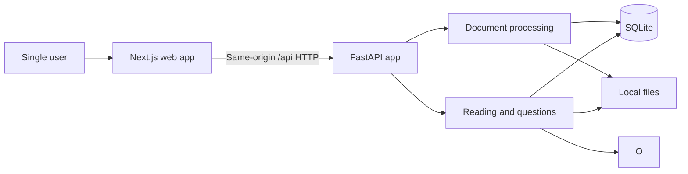

# MVP Architecture — AI Reading Companion V0

## Purpose and scope

This architecture implements the smallest product that can validate:

> Upload a PDF → listen → pause → ask → hear a deep explanation → continue.

V0 is a trusted, single-user prototype running on one host. It has no authentication, multi-user isolation, durable job queue, retrieval system, or production-scale infrastructure.

## 1. Architecture overview

The system has three runtime parts:

1. A Next.js web app renders the reader, records questions, and plays audio.
2. A FastAPI app owns document processing, reading position, context construction, model calls, and persistence.
3. SQLite and a local data directory store structured data, uploaded PDFs, and disposable generated audio.

Every reasoning, speech-to-text (STT), and text-to-speech (TTS) model call goes through OpenRouter. The browser accesses FastAPI through the same origin under `/api`; it never receives the OpenRouter API key or calls OpenRouter directly.

In local development, a Next.js rewrite proxies `/api` to FastAPI. A remotely accessed deployment must terminate HTTPS so browser microphone capture works.



## 2. Main end-to-end flow

### Upload and preparation

1. The user uploads one PDF.
2. FastAPI validates the file and configured size limit, saves it under an application-generated document ID, creates a `Document` with status `processing`, and returns the document immediately.
3. A FastAPI in-process background task uses `pypdf` to read metadata and outline destinations and `pdfplumber` to extract ordered layout lines with page, coordinates, font name, and font size.
4. Layout lines are reconstructed into ordered paragraphs. Lines in the same layout block are joined; a material vertical gap, indentation change, list marker, or heading starts a paragraph. End-of-line hyphenation is joined when safe. Blocks longer than `MAX_PARAGRAPH_CHARS` are split at sentence boundaries, falling back to a hard split. Each paragraph retains its source page range.
5. The processor creates one flat list of `Section` objects. A section may represent a book chapter, paper section, report heading, or generated reading section. Boundaries are chosen in this order:
   - use PDF outline or table-of-contents destinations when they produce usable page ranges; flatten them to one level, preferring chapter-level entries and expanding an oversized parent into its immediate children;
   - otherwise detect a consistent series of heading lines from layout. A candidate is at most 120 characters and has at least one strong signal: at least 1.2× the document's median body font size, bold styling plus surrounding vertical space, or a numbered heading pattern. At least two consistent candidates and `MIN_SECTION_CHARS` of following content are required;
   - otherwise create contiguous reading sections near `TARGET_SECTION_CHARS`, ending at the nearest paragraph boundary and titled `Section 1`, `Section 2`, and so on.
6. Any detected section above `MAX_SECTION_CHARS` is split at paragraph boundaries into continuations titled `{original title} (Part N)`. Sections never overlap, omit, reorder, or duplicate narration text.
7. When parsing succeeds, sections and paragraphs are written in one transaction and the document becomes `ready`. No model summaries are generated during upload. On failure, no partial derived content is retained and the document becomes `failed` with a user-facing error.
8. The web app polls the document endpoint until it is `ready` or `failed`.

Processing has three states: `processing`, `ready`, and `failed`. Allowed transitions are `processing → ready`, `processing → failed`, and `failed → processing` on retry. A retry replaces all derived content rather than appending to it. On backend startup, any document still marked `processing` becomes `failed` with an interrupted-processing error so it can be retried.

The initial limits are configuration, not database data:

- PDF upload: 50 MB;
- extracted document text: 1,000,000 characters;
- paragraph: 2,000 characters before sentence-aware splitting;
- minimum detected section: 1,000 characters;
- target fallback section: 30,000 characters;
- maximum section and whole-section question context: 100,000 characters.

These conservative character limits keep behavior easy to test across OpenRouter models. A limit violation is reported clearly rather than silently truncating source text.

### Listen

1. The web app loads the document's `current_paragraph_id` and requests that paragraph with nearby paragraphs.
2. It requests MP3 narration for the current paragraph. FastAPI serves an existing file or generates it through OpenRouter TTS and saves it at a predictable path containing the TTS configuration version and paragraph ID.
3. The browser plays one paragraph at a time, highlights it, and prefetches the next paragraph's audio.
4. On paragraph transition, pause, or skip, the browser saves the current paragraph ID on the document.
5. Playback speed is browser state. Skip backward selects the previous ordered paragraph, including across a section boundary.

Paragraph is the synchronization unit for highlighting and resume. Pausing midway through a paragraph resumes from the beginning of that paragraph; sentence-level alignment is out of scope.

### Ask, hear the answer, and continue

1. The user pauses and presses **Ask**. The browser records at most two minutes as `audio/webm` and uploads it with the current paragraph ID.
2. FastAPI verifies that the paragraph belongs to the requested document and transcribes the recording through OpenRouter STT.
3. Context scope uses a deliberately small rule, with no classifier model call:
   - default to local-passage context;
   - use section context only when the question explicitly refers to the chapter or section as a whole;
   - use limited book-wide context only when it explicitly refers to the book/document as a whole or asks where else something appears.
4. Local and book-wide scopes require section background. FastAPI loads the current section's cached summary and, if absent, generates and saves it from the bounded section text. No paragraph summaries are generated or persisted. Section scope sends the full bounded section and therefore does not generate an unused summary.
5. Document identity contains the extracted title, author, document type, and ordered section titles. The system does not generate or store a whole-document summary.
6. Local context contains document identity, current section title and cached summary, previous two or three paragraphs, current paragraph, next paragraph, and the question.
7. Section context contains document identity, the full current section, and the question. Every stored section is already within `MAX_SECTION_CHARS`.
8. Book-wide context contains document identity, the current section summary, local context, and an instruction to state that full-document retrieval is unavailable.
9. The prompt permits the model to use prior knowledge about an identified work as general background. It must treat supplied PDF text as authoritative, distinguish background knowledge from the text, and never claim that something appears elsewhere in the uploaded document without supplied evidence.
10. The reasoning model returns text. FastAPI stores one `Interaction` containing the transcript, answer, paragraph, scope, and minimal model metadata, then returns it immediately.
11. The web app displays the answer and requests its MP3 from a separate audio endpoint. Answer TTS therefore has the same retryable, cache-on-demand behavior as paragraph TTS and cannot duplicate the stored interaction.
12. The browser plays the answer. When the user presses **Continue Reading**, narration resumes at the recorded paragraph.

Transcription and the textual answer use one normal request/response operation with a visible processing state. TTS is a separate request. Streaming, WebSockets, speech-to-speech orchestration, and interruption of an answer are out of scope.

## 3. Major components and boundaries

### Next.js web app

Responsibilities:

- upload a PDF and poll processing status;
- render the current and neighboring paragraphs;
- record a bounded `audio/webm` question;
- manage paragraph and answer audio playback;
- highlight the paragraph currently being narrated;
- expose play, pause, previous paragraph, playback speed, ask, and continue controls;
- persist paragraph changes through FastAPI.

Only audio element state, playback speed, loading state, and prefetched URLs remain in browser memory. The browser does not construct model context and is not the authoritative reading-position store.

### FastAPI HTTP layer

Route handlers validate transport data, call application functions, and map errors to one shape:

```text
{ "code": "stable_machine_code", "message": "user-facing text", "retryable": true | false }
```

Routes do not contain PDF parsing, prompt construction, OpenRouter request construction, or substantial SQL logic.

The V0 API surface is:

| Method and path | Purpose | Main response |
|---|---|---|
| `POST /api/documents` | Upload a PDF and start processing | Document ID and status |
| `GET /api/documents/{id}` | Poll status or load metadata and position | Document, status/error, current paragraph ID |
| `POST /api/documents/{id}/retry` | Retry a failed processing run | Updated document status |
| `GET /api/documents/{id}/reader?paragraph_id=...` | Load the selected paragraph and nearby ordered paragraphs | Reader window with stable paragraph IDs |
| `PUT /api/documents/{id}/position` | Save `{ paragraph_id }` | Saved paragraph ID |
| `GET /api/paragraphs/{id}/audio` | Get or generate paragraph narration | `audio/mpeg` |
| `POST /api/documents/{id}/interactions` | Upload question audio and produce transcript plus textual answer | Stored interaction |
| `GET /api/interactions/{id}/audio` | Get or generate answer narration | `audio/mpeg` |

### Document processing

This component owns PDF outline extraction, layout extraction, paragraph reconstruction, section-boundary detection, bounded fallback sectioning, and processing state transitions. Parsing and splitting are deterministic functions. It does not call OpenRouter.

The original PDF is retained. All derived section and paragraph rows are committed together only after processing succeeds. This makes retry semantics simple and prevents partial documents from becoming readable.

### Reading and question functions

Reading functions load ordered paragraphs, save position, and generate paragraph audio. Question functions transcribe audio, select the explicit scope rule, lazily generate the current section summary when the selected context needs it, build bounded context, request an answer, and store an interaction.

The context builder is pure application logic: persisted domain data plus a question produces an explicit scope and model input. The OpenRouter integration cannot query the database or choose passages.

### OpenRouter integration

Use one small backend module with the exact operations V0 needs:

- `generate_text(prompt) -> text`;
- `transcribe(recording) -> text`;
- `synthesize(text) -> mp3 bytes`.

The module calls OpenRouter's text-generation, `/audio/transcriptions`, and `/audio/speech` endpoints with `httpx` and returns application-owned values. It centralizes authentication, timeouts, error mapping, request IDs, and model configuration.

This is not a generic provider layer. There are no provider interfaces, registries, SDK adapters, runtime routing rules, or direct credentials for underlying model providers. OpenRouter performs provider routing; the application chooses only an OpenRouter model ID for each capability.

### Persistence

Use SQLAlchemy models and small query functions called by application services. Do not create repository classes, generic repositories, DTO mapping layers, or a separate domain-model hierarchy. Use Alembic for schema changes so prototype data can survive iteration.

SQLite runs in WAL mode. Exactly one backend process may write to it or execute background work. Slow OpenRouter calls never run inside a database transaction.

## 4. Data and state

### Persisted domain objects

| Object | Important fields |
|---|---|
| `Document` | ID, title, author, document type, source path, status, failure code/message, current paragraph ID, timestamps |
| `Section` | ID, document ID, order, title, boundary source (`outline`, `heading`, or `fallback`), nullable cached summary, summary prompt version/model ID, start/end page |
| `Paragraph` | ID, section ID, order, text, start/end page |
| `Interaction` | ID, paragraph ID, question transcript, answer text, context scope, prompt version, OpenRouter model ID, created time |

Foreign keys are not duplicated when they can be derived: a paragraph determines its section and document, and an interaction determines all three through its paragraph. `current_paragraph_id` lives on `Document` because there is one user and one reading position per document.

Persist the original PDF, normalized sections and paragraphs, lazily cached section summaries, processing errors, reading position, and textual interactions. Do not persist a whole-document or paragraph summary. The question recording is deleted after successful transcription and may also be deleted after a failed request once its error has been returned.

Generated MP3 files are disposable and are not represented by database rows. Their paths are:

- `audio/{tts_config_version}/paragraphs/{paragraph_id}.mp3`;
- `audio/{tts_config_version}/interactions/{interaction_id}.mp3`.

If an audio file is absent, the backend regenerates it from authoritative text. Playback time, prefetched audio, recording state, polling state, and assembled prompts remain temporary.

## 5. External integrations

All model capabilities use one OpenRouter account and API key:

| Capability | Initial OpenRouter model | OpenRouter endpoint |
|---|---|---|
| Lazy section summaries and explanations | `openai/gpt-5.6-sol` | `/api/v1/chat/completions` |
| Recorded-question transcription | `openai/gpt-4o-transcribe` | `/api/v1/audio/transcriptions` |
| Long-form narration | `microsoft/mai-voice-2` | `/api/v1/audio/speech` with MP3 output |

These model IDs are initial quality-oriented defaults, not architecture invariants. `OPENROUTER_REASONING_MODEL`, `OPENROUTER_STT_MODEL`, `OPENROUTER_TTS_MODEL`, and `OPENROUTER_TTS_VOICE` are required configuration. The TTS voice must be one supported by the configured OpenRouter model and is selected through a short listening comparison. Changing a model or voice changes configuration and the audio-cache version, not application code or schema.

OpenRouter's transcription endpoint accepts browser-produced WebM and its speech endpoint can return MP3. The backend sends the bounded recording to OpenRouter and does not expose audio or model calls from the browser.

The integration uses explicit timeouts and one bounded retry for transient network, rate-limit, and upstream errors. Permanent errors are surfaced in the stable API error shape. Logs may contain document IDs, OpenRouter generation IDs, durations, costs, and error codes, but not full passages, prompts, answers, or audio.

`OPENROUTER_API_KEY` remains a backend environment variable. The application does not store or accept direct OpenAI, Microsoft, or other underlying provider credentials.

PDF parsing uses `pypdf` only for metadata and outline destinations and `pdfplumber` for layout-aware text extraction. V0 has no OCR, cloud document processing, embeddings, vector storage, external search, or analytics requirement.

## 6. Key technical decisions

### Recommended stack

| Area | Choice | Reason |
|---|---|---|
| Web UI | Next.js, React, TypeScript | Matches the RFC and supports browser media APIs |
| API | Python 3.12+, FastAPI, Pydantic | Matches the RFC and fits PDF/model work |
| Database | SQLite in WAL mode | No database service for a one-user prototype |
| Data access | SQLAlchemy 2.x and Alembic | Small explicit schema with safe iteration |
| PDF extraction | `pypdf` plus `pdfplumber` | Outline destinations plus layout-aware text and typography |
| AI and speech | OpenRouter REST API through one `httpx` module | One gateway and credential for all model capabilities |
| HTTP | Same-origin JSON REST plus multipart uploads | Simple browser/API integration without CORS |
| Background work | One FastAPI in-process task for document preparation | Avoids a queue and worker |
| Testing | Pytest, Vitest/React Testing Library, and one Playwright core-loop test | Focused unit, UI, and integration coverage |
| Deployment | One HTTPS host, separate web/API processes, one persistent volume | Matches the single-user operating model |

### Choices and tradeoffs

**Separate Next.js and FastAPI apps.** This follows the RFC and keeps browser media work in React and PDF/model work in Python. The small API table is the contract between them.

**In-process document preparation.** This keeps infrastructure minimal. A process restart interrupts work; startup reconciliation turns that into an explicit retriable failure. The backend must run with one worker.

**Paragraph is the stable reading unit.** It makes highlighting, skipping, context, caching, and resume deterministic without forced audio alignment.

**Generate MP3 on demand.** This avoids narrating an entire unread book during upload. The first play may wait for TTS; prefetching only the next paragraph limits that delay and cost.

**Use relational rows, but no repository architecture.** Sections, paragraphs, and interactions need ordered access and foreign-key integrity. SQLAlchemy query functions are sufficient for V0.

**Use explicit hierarchical context, not retrieval.** The context builder follows the RFC and is inspectable in tests. No embeddings, vector database, full-document search, agents, or hidden retrieval path exists.

**Use one flat, lossless section structure.** Book chapters, paper/report headings, and generated fallback chunks share the same `Section` object. Semantic signals are preferred, but every document receives bounded sections. Stored text never overlaps; overlap, if ever needed for a model prompt, is assembled temporarily from neighboring paragraphs.

**Generate section summaries lazily and omit a document summary.** Upload performs no model reasoning. The first local or book-wide question that needs section background pays the one-time summary latency and cost; later questions reuse it. A section-wide question uses the bounded section text directly. Document-level context is identity metadata plus section titles, with model prior knowledge permitted only as non-authoritative background.

**Use OpenRouter as the only model gateway.** It allows model changes without multiple provider integrations or credentials. The tradeoff is dependence on OpenRouter's endpoint behavior, model catalog, routing, and availability.

**Use normal HTTP.** Polling for document status and visible waiting states are adequate for one user. Separating answer text from answer TTS provides a useful retry boundary without introducing streaming or sockets.

### Testing approach

- Unit-test nested-outline flattening, heading detection, paragraph reconstruction, bounded fallback sections, no-loss/no-overlap ordering, lazy section-summary caching, scope rules, context bounds, prior-knowledge prompt guardrails, and audio paths as pure logic.
- Test processing state transitions and query functions against a temporary SQLite database, including interrupted processing and retry without duplicate rows.
- Replace the three OpenRouter operations with fakes for service and API tests. Keep a small opt-in live OpenRouter smoke test for each configured model.
- Store small legal PDF fixtures for bookmarks, no bookmarks, long text blocks, and no extractable text.
- Run the Playwright happy path against the real Next.js and FastAPI apps with a temporary SQLite database and fake OpenRouter operations: upload, wait until ready, play/pause, submit prerecorded audio, display/play the answer, and continue from the same paragraph.

## Assumptions

- V0 has one trusted user and does not need accounts, authorization, quotas, or user-level isolation.
- It runs on one host, with one backend process and a persistent writable volume.
- Remote access uses HTTPS; localhost development may use HTTP.
- PDFs are nonfiction documents with extractable text. Encrypted, malformed, image-only, or over-limit PDFs may be rejected.
- A flat section list is sufficient; nested PDF structure is normalized to chapter/section-sized reading units.
- Documents without reliable structural signals use bounded contiguous fallback sections rather than one giant section.
- English is the initial document, question, answer, and narration language.
- The user explicitly presses Ask and Continue. Wake words, voice activity detection, and answer interruption are out of scope.
- Book-wide questions have the RFC's explicit limitation.
- V0 generates no whole-document summary; a section summary is generated only when a selected question context first needs it and is then cached.
- Model prior knowledge about an identified work is optional background and never overrides or substitutes for supplied PDF text.
- All reasoning, STT, and TTS model traffic goes through OpenRouter.

## Architecture invariants

1. The core loop remains **Listen → Pause → Ask → Understand → Continue**.
2. Paragraph IDs and ordering are canonical for display, context, navigation, narration, and resume.
3. Ordered sections partition normalized paragraphs exactly once: no gaps, overlap, duplication, or reordering.
4. Source text is never silently truncated; configured limits produce a clear error or deterministic chunking.
5. Context selection is explicit, bounded, and testable without a model call.
6. The reasoning model receives only document identity, the cached current-section summary or bounded section text, local passages, and the question; there is no implicit retrieval.
7. All model traffic and credentials remain behind the single backend OpenRouter module.
8. The uploaded PDF and normalized source text are authoritative. Model prior knowledge and generated section summaries are supporting context, and generated audio is disposable.
9. Slow OpenRouter calls never run inside database transactions.
10. Processing publishes all derived content together or none of it; retry cannot duplicate derived rows.
11. V0 uses exactly one backend worker and no authentication, durable queue, vector database, or multi-agent system.
12. End-to-end tests cross the real browser/API boundary and replace only OpenRouter calls.
13. New abstractions must solve a present V0 problem or make an existing boundary directly testable.
